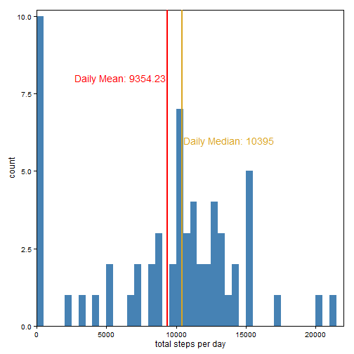
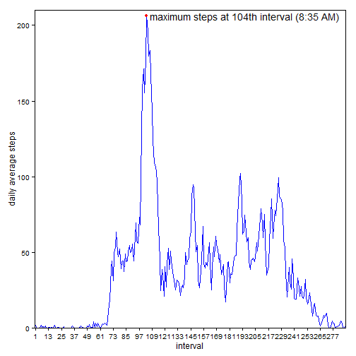
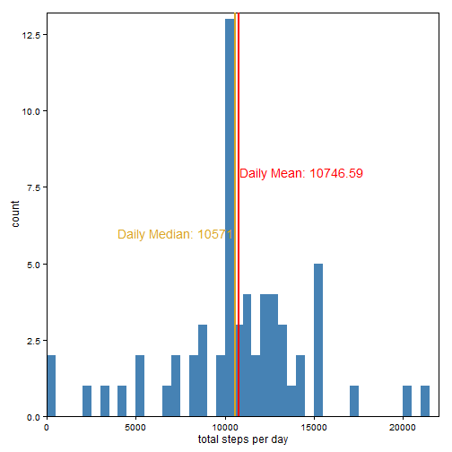
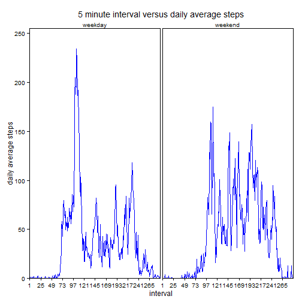

## Loading and preprocessing the data
The only adjustment to the data I found neccesary was altering the interval's to
be more like real time values. Originally I thought they were numbers increasing 
by 5 for the entire set. But there is a jump from 55-100, 155-200, and so on.
This suggests they are actually the 24 hour time. This creates odd
jumps in the plot later, so it is best to reformat the interval data
to look like a time string. I accomplish this by zero-padding the 
numbers with sprintf, and then using gsub to insert a colon in between the hours
and minutes.

```r
#checks for the csv file, if it is not in the directory check for the zip file
#if the zip file is misssing download it, otherwise extract the .csv from the
# zip file. Once the file existince is assured, read the .csv file in
if (!file.exists('activity.csv')) {
     if (!file.exists('activity.zip')) {
          fileurl<-'https://d396qusza40orc.cloudfront.net/repdata%2Fdata%2Factivity.zip'
          download.file(fileurl,dest='./activity.zip')
     }
     unzip('activity.zip')
}
activity <- read.csv('activity.csv')

#change the interval value to be more representative of times

#first front pad the timestamps with zeros so all are 4 digits
activity$interval <- sprintf("%04d",activity$interval)

#now insert a colon in the middle of each digit to make it look timelike
activity$interval <- gsub(pattern = '([0-9]{2})([0-9]{2})',
                          replacement = '\\1:\\2',
                          x = activity$interval)
```

## What is mean total number of steps taken per day?
I found that the easiest way to calculate on subsets of the data was by using
the aggregate function. This allows you to subset a list and apply functions on
the subsets, similar to the apply functions, but for subsets rather than the 
entire list.

```r
#compute the total daily steps
dailysteps <- aggregate(list('mean' = activity[,1]),
                        list('interval' = activity[,2]),
                        sum,
                        na.rm=TRUE)

#now calculate the mean and median values of total daily steps
dailymean <- mean(dailysteps$mean,na.rm=TRUE)
dailymedian <- median(dailysteps$mean,na.rm=TRUE)

#we will be using ggplot for all the plotting, so load package now
library(ggplot2)
    
#plot the histogram of total daily steps
g <- ggplot(dailysteps,aes(x=mean)) + 
     geom_histogram(fill="steelblue",binwidth=500)

#add annotations to the plot displaying the mean and median values calculated
#earlier, also set the plot to look the way I want it to
g + theme_minimal() + 
     theme(panel.background = element_rect(),
           panel.grid.major = element_blank(),
           panel.grid.minor = element_blank(),
           plot.background = element_rect(colour=NA,fill=NA),
           axis.line = element_line(colour = 'black')
           ) +
     coord_cartesian(xlim = c(0,22000),
                     ylim = c(0,10.2)
                     ) +
     labs(x = "total steps per day"
          ) +
     annotate('text',
              x = dailymean-100,
              y = 8,
              label = sprintf('Daily Mean: %4.2f',dailymean),
              hjust = 1,
              colour = 'red'
              ) +
     annotate('text',
              x = dailymedian+100,
              y = 6,
              label = sprintf('Daily Median: %i',dailymedian),
              hjust = 0,
              colour = 'goldenrod'
              ) +
     geom_vline(xintercept=dailymean,
               colour = 'red',
               size = 1
               ) +
     geom_vline(xintercept=dailymedian,
               colour = 'goldenrod',
               size = 1
               ) 
```

 


## What is the average daily activity pattern?
Once again this is easily calculated using the aggregate function. Because the
instructions say to plot versus the 5-minute interval that is the way I have set
it up. But with the preprocessing done above it would be easy to make it display
the x-axis as time during the day, which would be a little clearer what is going
on. 

```r
#calculate the average steps for each time interval
averagesteps <- aggregate(list('mean' = activity[,1]),
                          list('interval' = activity[,3]),
                          mean,
                          na.rm=TRUE)
    
#generate the plot
g <- ggplot(averagesteps,aes(x=interval,y=mean)) +
     geom_line(aes(group=1),colour="blue")
# label the y axis
g <- g + labs(y = "daily average steps")
# reset the x ticks to 1 per hour
g <- g + scale_x_discrete(breaks = activity$interval[seq(1,288,12)],
                          labels = seq(1,288,12))

#calculate the maximum average step value and when it occurs
maxind <- which(averagesteps$mean==max(averagesteps$mean))
maxval <- averagesteps$mean[maxind]
maxspot <- averagesteps$interval[maxind]
textspot <- averagesteps$interval[maxind+3]


#add the maximum step value to the plot and make it look how I want
g + geom_point(aes(x=maxspot,y=maxval),colour='red') +
     annotate("text",x=textspot,y=maxval,
              label = "maximum steps at 104th interval (8:35 AM)",
              hjust = 0
              ) + 
     theme_minimal() + 
     theme(panel.background = element_rect(),
           panel.grid.major = element_blank(),
           panel.grid.minor = element_blank(),
           plot.background = element_rect(colour=NA,fill=NA),
           axis.line = element_line(colour = 'black')
           ) +
     coord_cartesian(ylim = c(0,210))
```

 


## Imputing missing values
The number of missing values can be easily calculated with the is.na() command. 
This can be combined with the table() command to easily get the total 
number of NA's in the data set.


```r
table(is.na(activity))
```

```
## 
## FALSE  TRUE 
## 50400  2304
```
So there are 2304 NA's in the data set  
I decided to replace the missing values with average values based on whether it 
was a weekday or a weekend.


```r
#import the chron library to use the is.weekend() function
library(chron)
#get a list of indices for weekend days and weekday days
splitlist <- is.weekend(activity[,2])

#create datasets of just the weekdays and just the weekends
weekdays <- activity[!splitlist,]
weekends <- activity[splitlist,]

#calculate the average by interval for weekdays versus weekends
averageweekday <- aggregate(list('mean' = weekdays[,1]),
                          list('interval' = weekdays[,3]),
                          mean,
                          na.rm=TRUE)
averageweekend <- aggregate(list('mean' = weekends[,1]),
                          list('interval' = weekends[,3]),
                          mean,
                          na.rm=TRUE)

#now use the values calculated above to replace the NA values with the 
#average value for the coresponding day type
iactivity <- activity
indiceswd <- is.na(activity[,1])&!splitlist
indiceswe <- is.na(activity[,1])&splitlist
iactivity[indiceswd,1] <- as.integer(averageweekday$mean)
iactivity[indiceswe,1] <- as.integer(averageweekend$mean)

#now generate the daily total for the dataset with the infered values added in
idailysteps <- aggregate(iactivity[,1],list(iactivity[,2]),sum,na.rm=TRUE)

#calculate the mean and median for the total
idailymean <- mean(idailysteps$x,na.rm=TRUE)
idailymedian <- median(idailysteps$x,na.rm=TRUE)

#plot the histogram
g <- ggplot(idailysteps,aes(x)) +
     geom_histogram(fill="steelblue",binwidth=500)

#annotations and display the median and mean value
g + theme_minimal() + 
     theme(panel.background = element_rect(),
           panel.grid.major = element_blank(),
           panel.grid.minor = element_blank(),
           plot.background = element_rect(colour=NA,fill=NA),
           axis.line = element_line(colour = 'black')
           ) +
     coord_cartesian(xlim = c(0,22000),
                     ylim = c(0,13.2)
                     ) +
     labs(x = "total steps per day"
          ) +
     annotate('text',
              x = idailymean+100,
              y = 8,
              label = sprintf('Daily Mean: %4.2f',idailymean),
              hjust = 0,
              colour = 'red'
              ) +
     annotate('text',
              x = idailymedian-100,
              y = 6,
              label = sprintf('Daily Median: %i',idailymedian),
              hjust = 1,
              colour = 'goldenrod'
              ) +
     geom_vline(xintercept=idailymean,
               colour = 'red',
               size = 1
               ) +
     geom_vline(xintercept=idailymedian,
               colour = 'goldenrod',
               size = 1
               ) 
```

 
The median value does not change dramatically based on imputing values for the
NA's. At least for the way I calculated them. The mean shifts upward by ~15%.
This is primarily due to a reduction in the number of zero step days from 10 to
2 once the NA filled days are removed. By imputing the missing days the
distribution of steps per day has become less skewed.

## Are there differences in activity patterns between weekdays and weekends?
Since I had already created a set of indices for weekends versus weekdays
I could use that to add the day factor to the previous dataset. However, I
found it easier to create a new dataset for generating the plot.

```r
#generate the factor levels for the iactivity data frame
iactivity$daytype <- factor(c('weekday','weekend'))

#set the factor levels based on the previously generated weekday/weekend indices
iactivity$daytype[splitlist] <- 'weekend'
iactivity$daytype[!splitlist] <- 'weekday'

#create a vertically merged list of the averages for weekends and weekdays that
#I used to replace the NA values in the above section. Then attach the weekday
#or weekend factor to this for the faceting in ggplot
averagebydays <- rbind(averageweekday,averageweekend)
averagebydays$daytype <- factor(c('weekday','weekend'))
averagebydays$daytype[1:288] <- 'weekday'
averagebydays$daytype[289:576] <- 'weekend'

#generate the plot and put labels on it, use 2 hour steps in the x-axis beacuse
#there is less space available than in the single pane version
g <- ggplot(averagebydays,aes(x=interval,y=mean)) + 
     geom_line(aes(group=1),colour="blue") +
     labs(title = "5 minute interval versus daily average steps",
          x = "interval",
          y = "daily average steps") +
     scale_x_discrete(breaks = iactivity$interval[seq(1,288,24)],
                          labels = seq(1,288,24))
#set up the faceting by weekday/weekend and make plot look how I want it to
g + facet_grid(.~daytype) +
     theme_minimal() + 
     theme(panel.background = element_rect(),
           panel.grid.major = element_blank(),
           panel.grid.minor = element_blank(),
           plot.background = element_rect(colour=NA,fill=NA),
           axis.line = element_line(colour = 'black')) +
     coord_cartesian(ylim = c(0,255))
```

 
