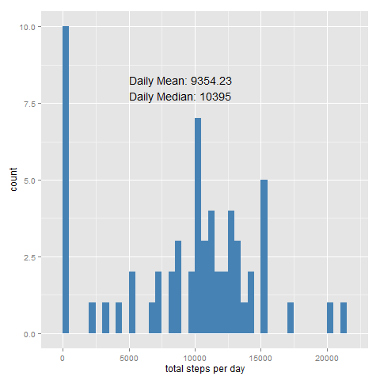
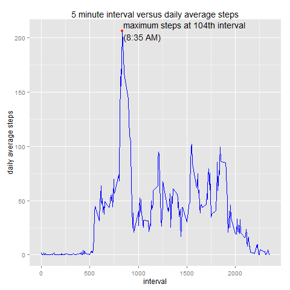

# Reproducible Research: Peer Assessment 1


## Loading and preprocessing the data
```r
#checks for the csv file, if it is not in the directory check for the zip file
#if the zip file is misssing download it, otherwise extract the .csv from the
# zip file. Once the file existince is assured, read the .csv file in
if (!file.exists('activity.csv')) {
     if (!file.exists('activity.zip')) {
          fileurl<-'https://d396qusza40orc.cloudfront.net/repdata%2Fdata%2Factivity.zip'
          download.file(fileurl,dest='./activity.zip')
     }
     unzip('activity.zip')
}
activity <- read.csv('activity.csv')
```

## What is mean total number of steps taken per day?

```r
#compute the total daily steps
dailysteps <- aggregate(activity[,1],list(activity[,2]),sum,na.rm=TRUE)

#now calculate the average and median values of total daily steps
dailymean <- mean(dailysteps$x,na.rm=TRUE)
dailymedian <- median(dailysteps$x,na.rm=TRUE)

#we will be using ggplot for all the plotting, so load package now
require(ggplot2)

#create the figure which will be attached to the html
png(file = 'dailytotalhist.png',
    width = 480,
    height = 480,
    bg = 'transparent')
    
#plot the histogram of total daily steps
g <- ggplot(dailysteps,aes(x)) + geom_histogram(fill="steelblue",binwidth=500)

#add annotations to the plot displaying the mean and median values calculated
#earlier
g + annotate('text',
               x=5000,
               y=8,
               label=sprintf('Daily Mean: %4.2f\nDaily Median: %i',
                             dailymean,dailymedian),
               hjust = 0) +
     labs(x = "total steps per day")
#remember to turn off the device so it will actually create the plot
dev.off()
```
 

```r
## What is the average daily activity pattern?

#calculate the average steps for each time interval
averagesteps <- aggregate(list('mean' = activity[,1])
                          ,list('interval' = activity[,3]),
                          mean,
                          na.rm=TRUE)

#create the png file
png(file = 'averageactivity.png',
    width = 480,
    height = 480,
    bg = 'transparent')
    
#generate the plot
g <- ggplot(averagesteps,aes(x=interval,y=mean)) + 
     geom_line(aes(group=1),colour="blue") +
     labs(title = "5 minute interval versus daily average steps",
          y = "daily average steps")

#calculate the maximum average step value and when it occurs
maxind <- which(averagesteps$mean==max(averagesteps$mean))
maxval <- averagesteps$mean[maxind]
maxspot <- averagesteps$interval[maxind]

#add the maximum step value to the plot
g + geom_point(aes(x=maxspot,y=maxval),colour='red') +
     annotate("text",x=maxspot+10,y=maxval,
              label = "maximum steps at 104th interval\n(8:35 AM)",
              hjust = 0)
#make sure to turn the plot off
dev.off()
```
 

## Imputing missing values


## Are there differences in activity patterns between weekdays and weekends?
